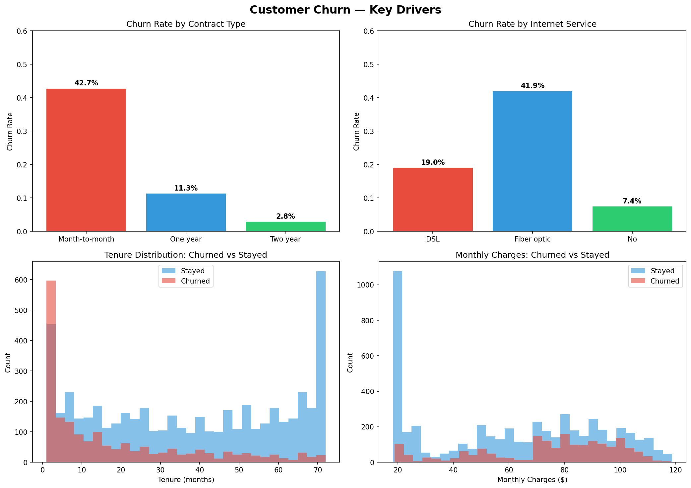
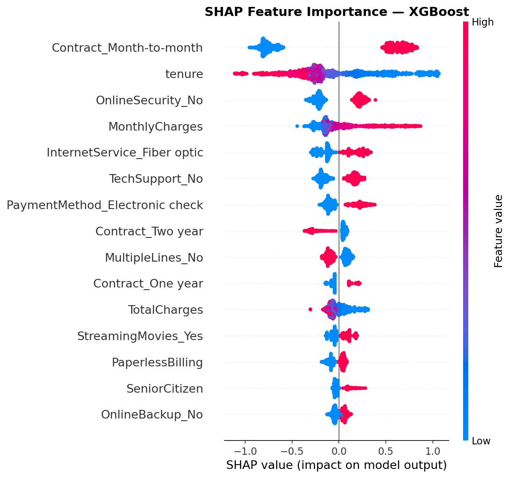
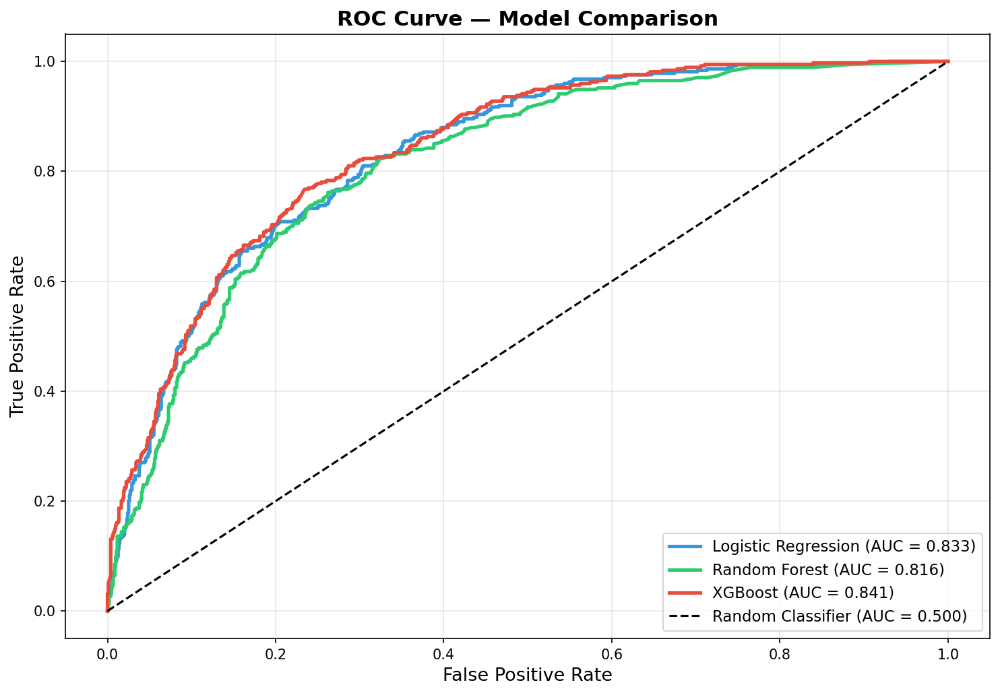
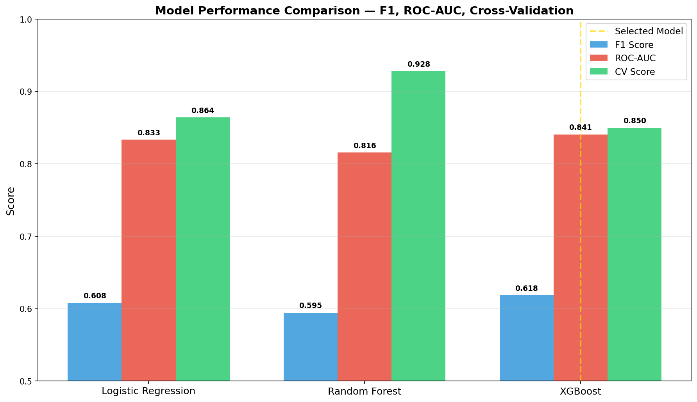

# 📉 Customer Churn Prediction System

A end-to-end machine learning system that predicts customer churn risk for a telecom company, 
identifies the key drivers behind each prediction, and deploys a live interactive tool 
for retention teams to prioritize outreach.

🚀 **[Live App → ponuoha-churn-prediction.streamlit.app](https://ponuoha-churn-prediction.streamlit.app/)**

---

## 🎯 Business Problem

Customer churn — when a customer cancels their service — directly impacts revenue. 
Acquiring a new customer costs significantly more than retaining an existing one. 
This system flags at-risk customers before they leave, giving retention teams a 
prioritized list of who to contact and exactly why they were flagged.

**Dataset:** IBM Telco Customer Churn — 7,032 customers, 40 features after encoding  
**Churn Rate:** 26.5% — a significant class imbalance requiring specialized handling

---

## 🧠 Technical Approach

### Preprocessing Pipeline
- Stratified 80/20 train/test split to preserve class distribution
- StandardScaler applied to training data only — preventing data leakage
- SMOTE applied exclusively to training set to handle class imbalance
- One-hot encoding for categorical features — eliminating false ordinal relationships

### Models Trained & Compared

| Model | F1 Score | ROC-AUC | CV Score |
|-------|----------|---------|----------|
| Logistic Regression | 0.608 | 0.833 | 0.864 |
| Random Forest | 0.595 | 0.816 | 0.928 |
| **XGBoost ✓** | **0.618** | **0.841** | **0.850** |

**XGBoost selected** as final model — highest F1 and ROC-AUC on held-out test data. 
Random Forest's CV score gap (0.928 vs 0.816 test) indicated overfitting. 
XGBoost used `scale_pos_weight` instead of SMOTE — the appropriate imbalance 
handling technique for gradient boosting.

### Why ROC-AUC Over Accuracy
In a real retention workflow, teams don't classify every customer — they rank them 
by risk and call the top N. ROC-AUC measures ranking quality directly. 
A score of 0.841 means the model reliably places real churners near the top of 
the risk-sorted list.

---

## 🔍 SHAP Explainability

Beyond global feature importance, this project implements SHAP (SHapley Additive 
exPlanations) to explain individual predictions — answering not just "who will churn" 
but "why this specific customer was flagged."

**Top churn drivers identified:**
- `Contract_Month-to-month` — mean SHAP impact: +0.69
- `tenure` — mean SHAP impact: +0.40
- `OnlineSecurity_No` — mean SHAP impact: +0.23
- `MonthlyCharges` — mean SHAP impact: +0.21
- `InternetService_Fiber optic` — mean SHAP impact: +0.18

**Highest risk customer in test set:** 94.4% predicted churn probability — verified 
correct. Short tenure (+0.85), month-to-month contract (+0.69), and $95 monthly 
charges (+0.29) were the dominant risk factors.

---

## 📊 Visualizations

| Visual | Description |
|--------|-------------|
|  | Key churn drivers — contract type, internet service, tenure, monthly charges |
|  | Global SHAP feature importance across all customers |
|  | ROC curve comparison — all three models vs random baseline |
|  | F1, ROC-AUC, and CV score comparison across models |

---

## 🚀 Live Application

The model is deployed as an interactive Streamlit web app. Input any customer profile 
and receive:
- Real-time churn probability score
- Three-tier risk classification (High / Medium / Low)
- SHAP-based explanation of the top features driving that specific prediction
- Retention priority recommendation

**→ [Launch App](https://ponuoha-churn-prediction.streamlit.app/)**

---

## 🧰 Tech Stack

**Modeling:** Python, XGBoost, Scikit-Learn, SMOTE (imbalanced-learn), SHAP  
**Data:** Pandas, NumPy  
**Visualization:** Matplotlib, Seaborn  
**Deployment:** Streamlit, Streamlit Cloud  
**Environment:** Jupyter Notebook, VS Code, Git/GitHub  

---

## 📁 Repository Structure

Churn-Prediction/
│
├── Churn_Prediction_v2.ipynb    ← Full ML pipeline notebook
├── app.py                        ← Streamlit web application
├── requirements.txt
├── README.md
│
├── Data/
│   └── Telco-Customer-Churn.csv
│
├── Models/
│   ├── xgboost_model.pkl
│   ├── scaler.pkl
│   ├── feature_names.pkl
│   └── model_performance.json
│
└── Visualizations/
├── churn_eda.png
├── shap_summary.png
├── shap_bar.png
├── shap_waterfall.png
├── roc_curve_comparison.png
└── model_comparison.png

---

## 👨🏽‍💻 Author

**Patrick Onuoha Jr.**  
B.S. Data Science — University of North Texas | GPA: 3.8  
🔗 [GitHub](https://github.com/PatrickOnuohaJr) | 
📧 [Email](mailto:ponuoha2017@gmail.com) | 
💼 [LinkedIn](https://www.linkedin.com/in/patrickonuohajr/)